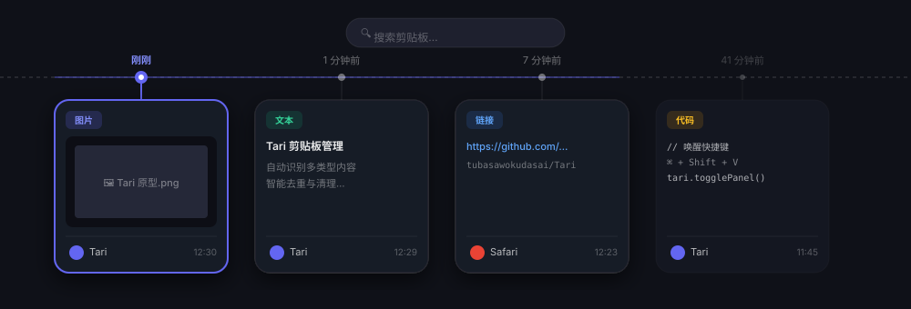
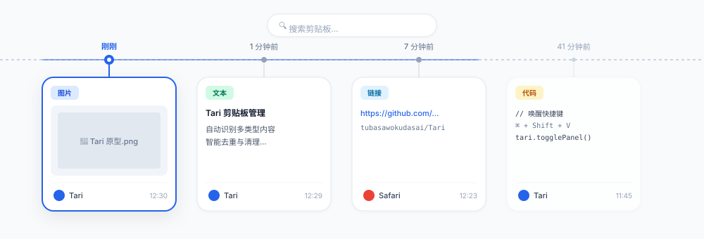

# Tari - macOS 剪贴板管理器

一款简洁、高效的 macOS 剪贴板历史管理工具。

---

## 🖼 界面预览

### 暗黑模式 (Dark Mode)

  

### 亮色模式 (Light Mode)

  

---

## ✨ 功能特性

- 📋 **多类型捕获**：自动记录文本、富文本、图片、多文件、代码片段与网页链接。
- 🌐 **实时预览**：支持内置网页浏览、图片平移与缩放查看以及文件路径定位。
- 🎨 **视觉主题**：自动提取来源应用图标配色，完美适应系统暗黑与亮色模式。
- ⚡ **快捷粘贴**：全局快捷键唤醒面板，选定卡片后自动粘贴至当前窗口。
- 🛠 **自动清理**：自定义保留时间与最大记录条数，智能去重与定期清理。
- 🔒 **本地存储**：数据仅存本地，无网络上传，保障数据隐私。

---

## ⌨️ 快捷键

| 操作 | 快捷键 | 说明 |
| :--- | :--- | :--- |
| **唤醒/隐藏** | `⌘ + Shift + V` | 全局快捷键（可自定义） |
| **偏好设置** | `⌘ + ,` | 打开设置 |
| **退出** | `⌘ + Q` | 退出应用 |
| **快速粘贴** | `双击` / `Enter` | 粘贴至当前窗口 |
| **定位文件** | `点击路径` | 在 Finder 中显示文件 |

---

## 🚀 系统要求

- **操作系统**: macOS 14.6+
- **辅助功能权限**: 首次使用需在 `系统设置` -> `隐私与安全性` -> `辅助功能` 中开启 Tari 的控制权限。

---

## 📄 许可证

[MIT License](LICENSE)